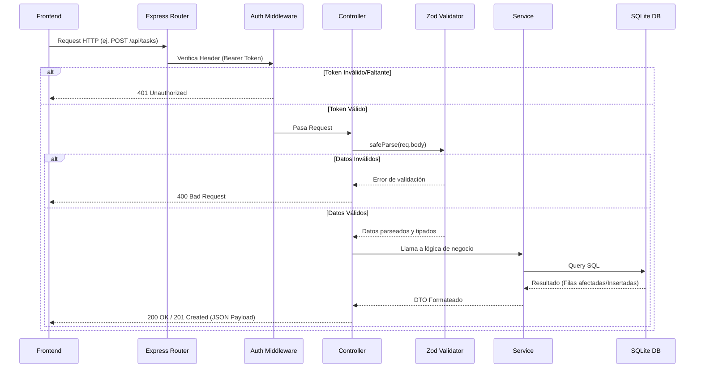

# Backend - Task Management API

Este es el servidor Backend de la aplicación de Gestión de Tareas. Está construido utilizando **Node.js, Express y TypeScript**, y expone una API RESTful documentada e interactiva mediante Swagger.

## 🚀 Features Principales

- **CRUD Completo:** Operaciones completas de Crear, Leer, Actualizar y Eliminar tareas.
- **Autenticación Básica:** Middleware de validación mediante `Bearer Token` requerido en todas las peticiones.
- **Validación Estricta:** Uso intensivo de `Zod` para asegurar que las cargas útiles (payloads) de los usuarios cumplan con longitudes, tipos de datos y formatos obligatorios antes de procesar lógica de negocio.
- **Documentación Swagger:** Interfaz visual de documentación autogenerada y siempre disponible en `/api-docs`.
- **Testing Unitario:** Pruebas unitarias configuradas con `Jest` para la capa de servicios haciendo mock de la base de datos.
- **Persistencia Ligera Relacional:** Base de datos **SQLite** gestionada de forma asíncrona que persiste en un archivo físico local de forma autónoma.
- **TypeScript & Clean Architecture:** Código fuertemente tipado separado en capas claras (Rutas, Controladores, Servicios, Modelos, Validaciones).

## 🏗️ Arquitectura y Estructura

El backend utiliza una arquitectura multicapa estándar, lo que promueve el principio de Responsabilidad Única (SRP) y facilita el testing.

- `src/index.ts`: Punto de entrada de la aplicación. Configura middlewares globales, inyecta variables de entorno y monta las rutas.
- `src/routes/`: Define las URLs expuestas al cliente y las enlaza a los controladores correspondientes. Aquí también se aplican middlewares de rutas (como la autenticación).
- `src/middleware/`: Interceptores de tráfico. Principalmente contiene `auth.middleware.ts` para verificar la existencia del token.
- `src/controllers/`: Controladores encargados puramente de manejar objetos HTTP (Request/Response). Manejan excepciones, validan datos invocando los schemas y coordinan llamadas a servicios.
- `src/services/`: Toda la lógica de negocio y las llamadas asincrónicas a la base de datos radican aquí.
- `src/validations/`: Esquemas de validación generados con Zod.
- `src/models/`: Declaración de tipos e interfaces puras de TypeScript (Entidades y DTOs).

## 🔌 Conexiones y Base de Datos

- La aplicación inicializa de forma automática un archivo local `database.sqlite` mediante el módulo `sqlite` en el primer arranque.
- Emplea variables de entorno (`.env`) para definir parámetros como el puerto y el path de la BD.
- Responde únicamente peticiones bajo el prefijo `/api/tasks`.

## 📊 Diagrama de Flujo (Peticiones)

## 🛠️ Scripts Útiles
- `npm run dev`: Inicia el entorno de desarrollo usando `tsx watch` (Hot-reload activo).
- `npm run build`: Transpila TypeScript a JavaScript plano (carpeta `/dist`).
- `npm run test`: Corre el conjunto de pruebas unitarias locales mediante Jest.
